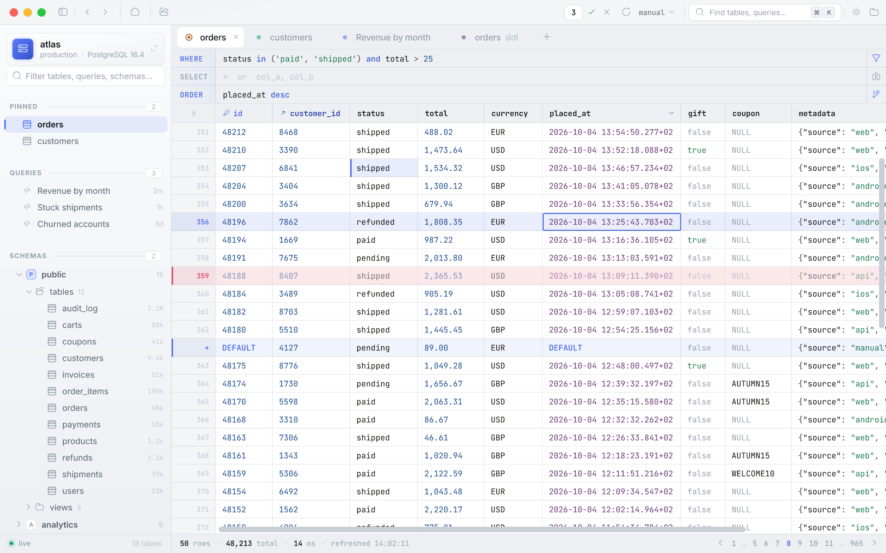

# Aperture

A native macOS client for PostgreSQL and SQLite: dense, keyboard-driven,
editable down to the cell. Built in Flutter.

<picture>
  <source media="(prefers-color-scheme: dark)" srcset="docs/screenshot-dark.png">
  
</picture>

Aperture started as one person's daily tool, and it still prefers density
and correctness over consumer polish. It is open source so you can use it,
read it, or fork it and make it yours.

## Features

**Browse**
- A sidebar with your saved connections, pinned tables, saved queries and
  the live schema tree, all filtered by one search field.
- <kbd>⌘K</kbd> opens a command palette that fuzzy-finds tables, open
  tabs, recent items, saved queries, connections and commands.
- <kbd>⌘[</kbd> and <kbd>⌘]</kbd> step back and forth through every tab
  switch, filter and sort.

**Edit data**
- The grid colours each cell by its type, keeps per-table column widths,
  and shows the full value on hover.
- Clause fields for `WHERE`, `SELECT` and `ORDER` take free SQL with
  highlighting. Click a column header for a multi-column sort.
- Double-click a cell to open an editor built for its type: text and JSON,
  bool, integer and numeric, date, time and timetz, timestamp and
  timestamptz. `NULL` and `DEFAULT` are one click away, and disabled
  wherever the schema forbids them.
- Edits, deletes and inserts stage in memory first. Before anything runs,
  you see every statement highlighted. **Apply** then sends the whole batch
  as one transaction, finding rows by `ctid` on Postgres and `rowid` on
  SQLite. If any statement would touch anything other than exactly one
  row, the whole batch rolls back.
- Right-click a cell to copy it (as a value, pretty JSON, or
  `column = …`), filter by its value, sort, follow its foreign key, or find
  the row in a related table.

**Run SQL**
- The editor has schema-fed autocomplete and a ▶ beside every statement.
  <kbd>⌘↵</kbd> runs the statement under the caret; <kbd>⌘⇧↵</kbd> runs
  the whole script.
- Scripts are split into statements by the client, so semicolons inside
  `'…'`, `E'…'`, `$$ … $$` / `$tag$ … $tag$` bodies and comments don't
  break them up, and each statement is sent on its own.
- A bare `SELECT` without a `LIMIT` is capped at 10,000 rows, and the grid
  tells you when that happened.
- Queries save automatically to their connection and survive restarts.

**Understand**
- `EXPLAIN` plans are drawn as a tree of timed nodes. A set of rules reads
  each plan and flags sequential scans, sorts that spill to disk, estimate
  mismatches and hash batches.
- Every table and view gets an object tab with plain-language **Info** and
  **DDL**: rebuilt from `pg_catalog` on Postgres, or taken verbatim from
  `sqlite_master` on SQLite.
- The activity log (<kbd>⌘L</kbd>) records every statement the app sent,
  with its timing, row count and errors.

**Stay connected**
- A 30-second keepalive notices a dropped socket. Instead of throwing you
  back to the welcome screen, it shows a reconnect banner and keeps your
  tabs.
- Tabs can auto-refresh, and they pause while edits are staged.
- Any table or result exports to CSV or Markdown, either streamed to a
  file (with a cancel button) or copied to the clipboard.

## Credentials and storage

Everything Aperture keeps (connections, saved queries, history,
preferences) lives in one SQLite file encrypted with **SQLCipher 4**:
`~/Library/Application Support/com.jwo1f.aperture/store.sqlite`. It is
locked by a passphrase you choose on first launch. You can have that
passphrase remembered in your login Keychain. There is no recovery: lose
the passphrase and the store has to be erased.

A connection's password can live in the encrypted store, or it can come
from a **password command**: a shell command that runs through your login
shell on every connect and prints the password, e.g.

```sh
op read "op://Private/atlas-prod/password"
security find-generic-password -s atlas-prod -w
```

The app sandbox is off on purpose, so Aperture can reopen SQLite files
anywhere on disk after a relaunch.

## Install

Download the DMG from
[Releases](https://github.com/JWo1F/aperture/releases), open it, and drag
Aperture to Applications.

Releases are signed with a Developer ID and notarized by Apple, so the app
opens like any other. Requires macOS 12 or later.

## Build from source

You need Flutter (stable channel) and a full Xcode install; the Command
Line Tools alone are not enough.

```sh
git clone https://github.com/JWo1F/aperture.git
cd aperture
flutter pub get
flutter run -d macos           # debug
tool/make_dmg.sh               # release build packed into dist/Aperture-<version>.dmg
```

A local `make_dmg.sh` build is ad-hoc signed: it runs on your Mac but not
on someone else's. To sign and notarize it the way CI does, set
`DEVELOPER_ID` to your "Developer ID Application" identity and
`NOTARY_PROFILE` to a profile saved with `xcrun notarytool store-credentials`
— see `tool/sign_app.sh` and `tool/notarize.sh`.

Before sending a change, run:

```sh
flutter analyze   # must report no issues, info-level lints included
flutter test
```

Only macOS is supported. The window chrome, the Keychain and the app menu
go through Swift method channels in `macos/Runner/`.

## Project layout

| Path | What |
|---|---|
| `lib/state/` | `ChangeNotifier` controllers behind a process-global `appState` (no `provider`) |
| `lib/services/` | Postgres and SQLite drivers, introspection, SQL rendering, the encrypted store |
| `lib/ui/` | The shell, sidebar, workspace tabs, results grid, editors, query plan view |
| `lib/theme/` | Both palettes, the type scale, and the Hugeicons glyph table |
| `macos/Runner/` | The window, Keychain and menu channels |
| `website/` | The project site: a Rust generator over [Damask](https://github.com/jwo1f/damask) components that redraws the app's screens as SVG |
| `tool/` | `make_dmg.sh`, Developer ID signing and notarization, the icon-table generator |

[CLAUDE.md](CLAUDE.md) is the detailed architecture guide: invariants,
driver quirks and known gaps. Read it before a non-trivial change.

## Contributing

This is a personal tool, maintained for its author's own workflow. Issues
are welcome. Pull requests are read, but may not be merged if they pull
the app away from that workflow. If you want it to go somewhere else, fork
it. That's what the license is for.

## License

[MIT](LICENSE) © Aleksandr Ivashkin.

Bundled third-party assets:
- [Inter](https://rsms.me/inter/) and [JetBrains Mono](https://www.jetbrains.com/lp/mono/),
  under the SIL Open Font License 1.1 ([`assets/fonts/OFL.txt`](assets/fonts/OFL.txt)).
- [Hugeicons](https://hugeicons.com) Free, stroke-rounded set, under the MIT License
  ([`assets/fonts/HUGEICONS-LICENSE.txt`](assets/fonts/HUGEICONS-LICENSE.txt)).
